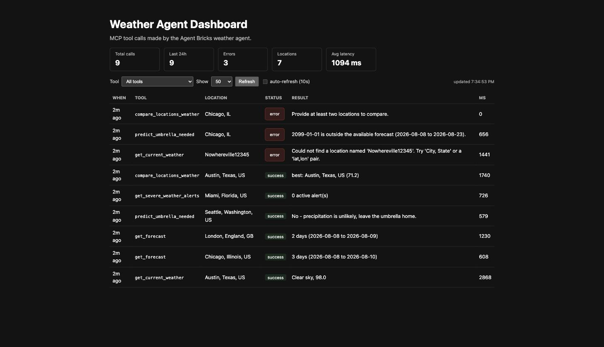

# Homework 3 — Weather-Prediction MCP Server + Agent Bricks Agent

A [FastMCP](https://gofastmcp.com) server exposing weather tools over MCP,
wired into a Databricks Agent Bricks agent, plus a dashboard showing what the
agent has been asking for. Two Databricks Apps, mirroring day 3's
`mcp_server/` + `dashboard/` split.

```
  user question
       │
       ▼
┌──────────────────────┐   MCP (streamable HTTP)   ┌──────────────────────────┐
│  Agent Bricks agent  │ ────────────────────────► │  App 1: MCP server       │
│  (Custom LLM)        │ ◄──────────────────────── │  weather_mcp_server.py   │
│  agent/system_prompt │      tool results         │  5 @mcp.tool functions   │
└──────────────────────┘                           └──────┬────────────┬──────┘
                                                          │            │
                                          thin tools ─────┘            │ one row
                                                   │                   │ per call
                                                   ▼                   ▼
                                        ┌────────────────────┐  ┌──────────────┐
                                        │  weather_api.py    │  │  Lakebase    │
                                        │  all HTTP+parsing  │  │ weather_     │
                                        └────┬──────────┬────┘  │ tool_calls   │
                                             ▼          ▼       └──────┬───────┘
                                      Open-Meteo   api.weather.gov     │ reads
                                      (geocode +    (severe weather    ▼
                                       forecast)        alerts)  ┌──────────────┐
                                                                 │ App 2:       │
                                                                 │ dashboard/   │
                                                                 │ Flask        │
                                                                 └──────────────┘
```

## Data source and why

**Open-Meteo** for geocoding, current conditions and the daily forecast, with
**the National Weather Service API** layered in for severe-weather alerts.

Open-Meteo needs no signup, no API key and no credit card, which means the
whole pipeline — server, tools, agent registration — could be built and tested
end to end without touching secrets management at all. It also covers the whole
world, so the agent does not fall over on "what's the weather in London?". Its
`weather_code` field maps cleanly onto readable conditions, and its
`precipitation_probability_max` / `precipitation_sum` fields are exactly the
inputs the prediction tool needs.

NWS is added as a second source for one thing Open-Meteo does not provide:
official, human-written severe-weather alerts with `description` and
`instruction` text. It is US-only, so `get_severe_weather_alerts` returns
`supported: false` outside the United States rather than failing, and the
worldwide forecast tools keep working.

### Authentication

**The weather APIs need no credentials.** Neither Open-Meteo nor api.weather.gov
uses an API key; NWS only asks for a descriptive `User-Agent`, which is a
contact string, not a secret, and lives in plaintext in `app.yaml`.

The one real secret is the **Lakebase connection URL**, used only to log tool
calls for the dashboard. It is stored in this homework's own Databricks secret
scope — `homework-3/lakebase-url`, created by [`setup_secrets.py`](setup_secrets.py)
— and read at startup with `WorkspaceClient().secrets.get_secret()`, the same
`_secret()` pattern as the lab example's `alpaca_broker.py`. Nothing
credential-shaped is committed: `.env` is gitignored and the `.env.example`
files hold placeholders only.

Note the dependency direction: **the weather tools do not need the database.**
Set `WEATHER_LOG_TOOL_CALLS=0` and the MCP server runs with no secret at all.

## Tools

| Tool                        | Arguments                                       | What it does                                                                                       |
| --------------------------- | ----------------------------------------------- | -------------------------------------------------------------------------------------------------- |
| `get_current_weather`       | `location`, `units="imperial"`                  | Temperature, feels-like, humidity, precipitation, wind and conditions right now.                   |
| `get_forecast`              | `location`, `days=3`, `units="imperial"`        | Daily high/low, precipitation chance and amount, max wind, sunrise/sunset. `days` clamped to 1–16. |
| `predict_umbrella_needed`   | `location`, `date="today"`                      | **The judgement tool.** Verdict yes/maybe/no plus the reasoning — see below.                       |
| `get_severe_weather_alerts` | `location`, `limit=10`                          | Active NWS alerts for a US point, with the official instruction text. _(stretch goal)_             |
| `compare_locations_weather` | `locations`, `date="today"`, `units="imperial"` | Ranks 2–5 places for one day by a comfort score. _(stretch goal)_                                  |

`location` accepts a place name (`"Chicago"`, `"Austin, TX"`, `"London, UK"`) or
a raw `"lat,lon"` pair. US state abbreviations are expanded before matching, so
`"Springfield, IL"` does not silently resolve to Springfield, Missouri.

`date` accepts `"today"`, `"tomorrow"` or an ISO `YYYY-MM-DD` inside the
16-day window, interpreted in the location's own timezone.

## Layout

```
homework-3/
├── mcp_server/                 App 1 — the MCP server
│   ├── weather_mcp_server.py   FastMCP entrypoint; 5 @mcp.tool functions,
│   │                           the _run wrapper, and the pure prediction/
│   │                           scoring helpers
│   ├── weather_api.py          adapter — every HTTP call and all parsing
│   ├── lakebase.py             psycopg2 + RealDictCursor connection helper
│   ├── schema.py               weather_tool_calls DDL, writes and reads
│   ├── smoke_test.py           drives the real MCP surface in-process
│   ├── app.yaml, requirements.txt, .env.example
│
├── dashboard/                  App 2 — the tool-call dashboard
│   ├── app.py                  Flask: /, /api/calls, /api/stats, /healthz
│   ├── lakebase.py             duplicate of the MCP server's copy
│   ├── schema.py               duplicate of the MCP server's copy
│   ├── templates/index.html, static/{app.js,style.css}
│   ├── app.yaml, requirements.txt, .env.example
│
├── setup_secrets.py            stores homework-3/lakebase-url, grants both apps
├── agent/system_prompt.md      the Agent Bricks system prompt + rationale
├── screenshots/
└── README.md
```

`lakebase.py` and `schema.py` are **duplicated** across the two folders on
purpose: each Databricks App deploys from its own directory, so they cannot
import a shared module. The lab example duplicates `alpaca_broker.py` and
`lakebase.py` the same way. Keep the copies in sync when editing.

## Running it

### Deploy — App 1, the MCP server

1. **Compute → Apps → Create app → Custom**, source `homework-3/mcp_server/`.
2. Deploy, wait for **Running**, and note the app URL.
3. Note the app's **service principal UUID** — `setup_secrets.py` needs it.

**The MCP endpoint is the app URL with `/mcp` appended** —
`https://<app-name>-<id>.databricksapps.com/mcp`. The bare app URL returns 404;
that is expected, there is no web UI on this app.

### Deploy — App 2, the dashboard

1. Same flow, source `homework-3/dashboard/`.
2. Note its service principal UUID too.

### Register the MCP server as an external MCP

1. Workspace → **Agents / AI Gateway → MCP servers → Add external MCP server**.
2. Give it a name (`weather-prediction`) and paste the `/mcp` URL.
3. Databricks introspects the server and should list all five tools. If it
   lists none, the URL is missing the `/mcp` suffix.
4. Grant the agent's identity access to the registered server.

### Build the Agent Bricks agent

1. **Agents → Agent Bricks → Create → Custom LLM**.
2. Add the registered `weather-prediction` MCP server as a tool source.
3. Paste the system prompt from [`agent/system_prompt.md`](agent/system_prompt.md)
   into the instructions field.
4. Test in the playground with the questions below, then deploy.

### Latest deploy

For validation and checking on how the agents works + checking dashboard you can access
the following links:

1. Dashboard

2. Mcp server

## The dashboard

Every MCP tool call is written to one Lakebase table:

```sql
CREATE TABLE weather_tool_calls (
    id            BIGSERIAL PRIMARY KEY,
    tool_name     TEXT NOT NULL,
    location      TEXT,            -- resolved name, or what was asked for on error
    arguments     JSONB NOT NULL,
    status        TEXT NOT NULL CHECK (status IN ('success', 'error')),
    verdict       TEXT,            -- yes/maybe/no, for predict_umbrella_needed
    summary       TEXT,            -- one-line result for the table
    error_message TEXT,
    duration_ms   INT,
    called_at     TIMESTAMPTZ NOT NULL DEFAULT now()
);
```

The dashboard reads it: total calls, calls in the last 24h, error count, distinct
locations, average latency, a per-tool breakdown, and the recent-calls table with
filtering by tool and optional 10-second auto-refresh.



_(Run locally against Postgres, showing the nine calls `smoke_test.py` makes —
including the three deliberate failures.)_

**Logging is best-effort by design.** `record_call()` never raises: an audit row
is worth less than a working weather answer, so a Lakebase outage costs you
history, not answers. After three consecutive write failures it disables itself
for the life of the process, so a dead database cannot add a connection timeout
to every tool call.

## Error handling

Every tool returns a dict with a `status` field and never raises across the MCP
boundary. `weather_api.py` converts timeouts, connection failures, non-2xx
responses and non-JSON bodies into `WeatherAPIError`; `_run()` catches that and
returns `{"status": "error", "message": ...}`. A bare `except Exception` behind
it logs the traceback server-side and returns a generic message, so an
unforeseen bug still reaches the agent as a sentence rather than a stack trace.

Cases that are handled deliberately rather than incidentally:

- Unresolvable place name → message suggesting `"City, State"` or `"lat,lon"`.
- Place found but not in the named region (`"Austin, ZZ"`) → error listing the
  three closest matches, so the agent can ask which one was meant.
- Date outside the 16-day window → error naming the actual range.
- Non-US location for alerts → success with `supported: false` and a note, not
  an error, since the question is answerable from the forecast tools.
- Fewer than two, or more than five, locations to compare → error.
- One unresolvable city inside a comparison → the other cities still rank; the
  failure is reported in an `errors` map.
- Lakebase unreachable → tools keep working; only the audit row is lost.

## Known limitations / what I'd do next

- **Forecast only, no history.** Open-Meteo has an archive API; "how hot was it
  last July?" currently gets a clean "I can't see the past" instead of an answer.
- **The comfort score is arbitrary.** The 60–80 °F band and the penalty weights
  are my judgement, not anyone's climatology, and they encode a temperate
  preference. It ranks consistently, which is what matters for "A or B?", but it
  should not be read as an objective quality-of-day number.
- **Daily granularity for the umbrella call.** A day whose rain all falls at
  3am scores the same as one raining at commute time. Open-Meteo's hourly
  endpoint plus a time-window argument would fix this and is the single biggest
  improvement available.
- **No caching, and a connection per log write.** Every tool call geocodes, then
  fetches, then opens a fresh psycopg2 connection to log. A TTL cache on
  `geocode()` — place names do not move — and a connection pool would both be
  easy wins.
- **The log has no conversation id.** Rows record _what_ was called, not which
  agent conversation drove it, so multi-turn sessions cannot be reconstructed.
  Threading the MCP session id through `_run()` is the natural next step.
- **Ambiguous city names resolve silently.** "Portland" picks Oregon. The
  mitigation is in the system prompt (echo the resolved location back to the
  user) rather than in the tool, which would be better placed to return
  candidates and ask.
- **Duplicated `lakebase.py` / `schema.py`.** Forced by the one-folder-per-app
  deploy model. A shared wheel installed by both `requirements.txt` files would
  be the grown-up fix.
